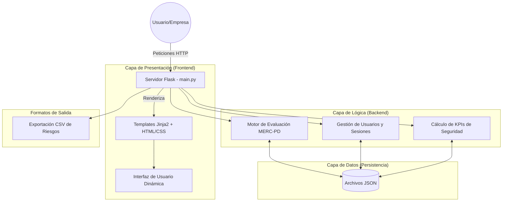

# Documento de Respaldo Técnico
## Sistema de Gestión de Riesgos de Seguridad de la Información (Metodología MERC-PD)

### 1. Diagrama de Arquitectura del Sistema

El sistema sigue una arquitectura de aplicación web monolítica basada en el patrón Modelo-Vista-Controlador (MVC), diseñada para ser ligera y fácil de desplegar.

### 2. Breve Explicación del Desarrollo y Herramientas Utilizadas

**Desarrollo:**
El sistema fue desarrollado utilizando un enfoque ágil, priorizando la facilidad de uso para pequeñas y medianas empresas (PyMEs). Se implementó un sistema multi-inquilino (multi-tenant) donde un usuario "Empresario" puede registrar su organización y supervisar a sus "Empleados". La lógica core se basa en la metodología **MERC-PD**, permitiendo identificar activos, amenazas y evaluar riesgos de forma cuantitativa y cualitativa.

**Herramientas y Tecnologías:**
*   **Lenguaje:** Python 3.x.
*   **Framework Web:** Flask (ligero, flexible y escalable).
*   **Seguridad:** Werkzeug (para el hashing y salting de contraseñas mediante PBKDF2).
*   **Frontend:** HTML5, CSS3, Jinja2 (motor de plantillas).
*   **Catálogo de Estándares:** Integración nativa de controles **ISO/IEC 27001:2022** con guía de aplicación.
*   **Gestión de Tratamiento:** Soporte para multiselección de controles por riesgo y cálculo de riesgo residual automatizado.
*   **Análisis de Datos:** Módulo `csv` para la generación de reportes descargables.
*   **Control de Versiones:** Git.

### 3. Capturas de Pantalla del Funcionamiento del Sistema

> [!NOTE]
> *Instrucciones para el usuario: Debe reemplazar estas descripciones con las imágenes reales capturadas de su navegador.*

1.  **Dashboard Principal:** Vista general de estadísticas (Activos críticos, riesgos altos, % de cumplimiento).
2.  **Registro de Activos:** Formulario de entrada de activos con criterios de Confidencialidad, Integridad y Disponibilidad (CID).
3.  **Matriz de Riesgos:** Visualización de los riesgos identificados y su nivel de criticidad (Bajo, Medio, Alto, Crítico).
4.  **Dashboard de KPIs:** Gráficos y medidores de los KPIs MERC-PD (Mitigación en <30 días, Incidentes prevenidos, Cobertura de capacitación).
5.  **Gestión de Empresa:** Interfaz donde el empresario aprueba o elimina miembros del equipo.

### 4. Conclusiones

*   Se logró implementar una herramienta funcional que digitaliza el proceso de gestión de riesgos bajo una metodología estándar, eliminando la dependencia de hojas de cálculo manuales.
*   La arquitectura basada en Flask y JSON permite una ejecución rápida con mínimos requerimientos de hardware.
*   El sistema cumple con los requisitos de seguridad básica, protegiendo las credenciales de los usuarios y separando los datos por organización.

### 5. Recomendaciones

*   **Seguridad:** Para un entorno de producción, se recomienda migrar la persistencia de datos de JSON a una base de datos relacional (como PostgreSQL) para manejar concurrencia.
*   **Funcionalidades:** Implementar notificaciones automáticas por correo electrónico cuando se detecte un riesgo crítico o cuando un empleado se registre.
*   **Cumplimiento:** Integrar más estándares internacionales como la ISO 27001 para ampliar el catálogo de controles sugeridos.
